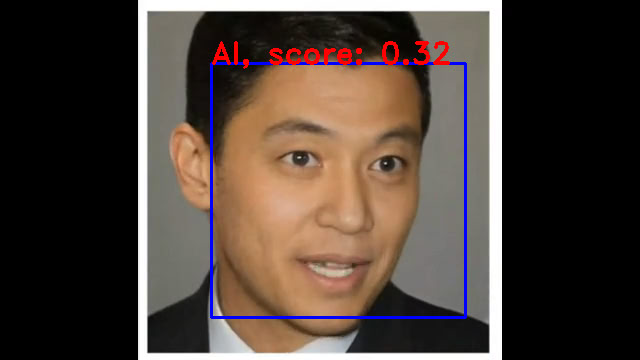

# AI-Generated Face Detection using Transfer Learning

    Image taken from Microsoft <a href="https://www.microsoft.com/en-us/research/project/vasa-1/">Vasa-1</a>

This repository is a proof of concept (PoC) that demonstrates how transfer learning can be used to detect AI-generated faces. By leveraging pre-trained models and fine-tuning them for the specific task of face detection, this project aims to show the potential of transfer learning in distinguishing between real and AI-generated faces.

## Table of Contents

- [Introduction](#introduction)
- [Project Structure](#project-structure)
- [Installation](#installation)
- [Usage](#usage)
- [Model Training](#model-training)
- [Inference](#inference)
- [Results](#results)
- [Acknowledgements](#acknowledgements)

## Introduction

As AI-generated images become increasingly realistic, the ability to differentiate between real and AI-generated faces is critical, particularly in defending against malicious or unethical uses of AI technology. Tools like this project aim to empower individuals, researchers, and organizations by providing a reliable method to detect AI-generated faces, which can help prevent misinformation, identity fraud, and other unethical applications of deepfake technology. By leveraging transfer learning, a powerful machine learning technique where pre-trained models are adapted for specific tasks, this project showcases how existing AI tools can be repurposed to protect privacy, maintain trust in digital content, and safeguard against AI misuse. The goal is not only to demonstrate the effectiveness of transfer learning for this use case, but also to contribute to responsible AI development and usage.

## Project Structure
The repository contains the following key files:

- **`train.ipynb`**: Jupyter notebook for training the model using transfer learning.
- **`inference.ipynb`**: Jupyter notebook for running inference on AI-generated face images to test the model's performance.
- **`fetch.sh`**: A script to fetch the imagenet pre-trained weights.
- **`resizing.sh`**: A script to resize videos to suitable size for the model to work with.

## Usage

### Setup environment

To train and infere from the model you first have to install the used libraries:
- Tensorflow 
- Keras
- OpenCv
- Numpy

Afterwards download the dataset from [Kaggle](https://www.kaggle.com/datasets/xhlulu/140k-real-and-fake-faces) and place it besides the project. Then you can use the `fetch.sh` for getting the `DenseNet121` weights and you should be good to go.

### Model Training

To train the model, run the `train.ipynb` notebook. It includes the following steps:

1. Load a pre-trained model.
2. Fine-tune the model using a dataset of real and AI-generated faces.
3. Save the trained model for inference.

### Inference

To test the model on new data, run the `inference.ipynb` notebook. This notebook allows you to:

1. Load the fine-tuned model.
2. Run predictions on videos **both in real-time (e.g. using your webcam) or from recorded videos**
3. View the results and performance metrics.

## Results

The results of this project demonstrate the power of transfer learning for AI-generated face detection. By using pre-trained models, the training time is reduced, and the model achieves good accuracy in distinguishing between real and AI-generated faces.